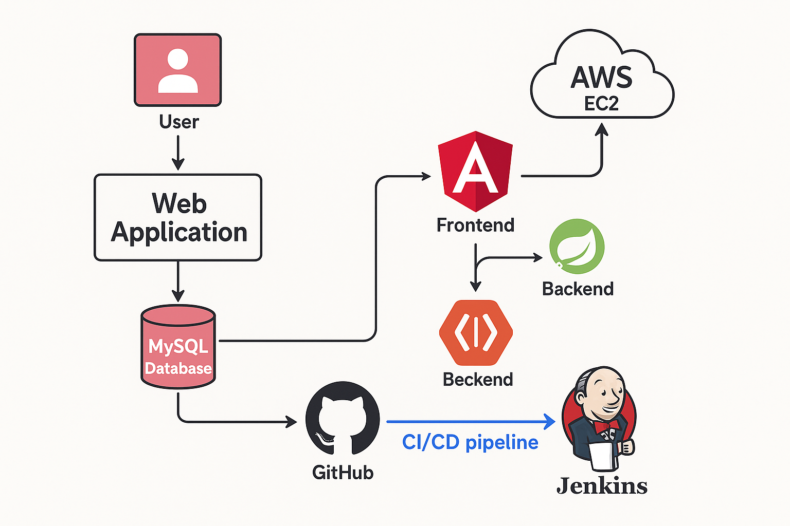
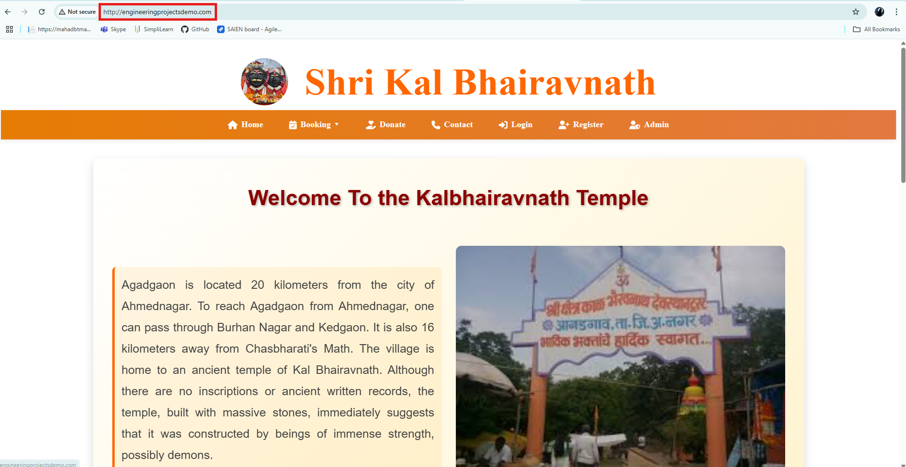
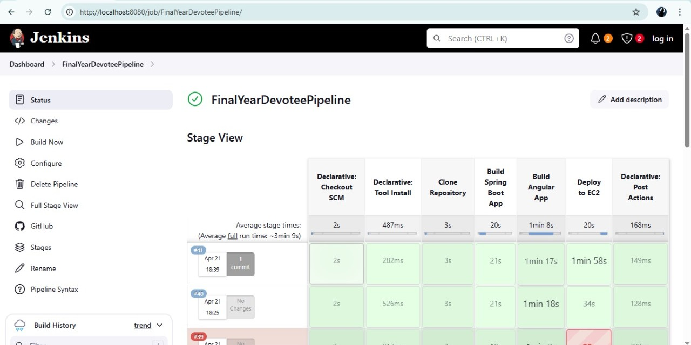

# 🙏 Agadgaon Devotee Management System

## 📌 Introduction 

A **Full Stack Web Application** tailored for the devotees of **Agadgaon** village. This platform streamlines the process of **registrations**, **bookings** (Pangat, Prasad, Darshan), **donations**, and **slot availability**. Designed for both **devotees** and **admins**, it ensures a smooth, organized, and user-friendly experience.

---

## ✨ Key Features

- 🧑‍💼 **Devotee Registration:** Secure and easy sign-up process for devotees.
- 📅 **Smart Booking System:** Book **Pangat**, **Prasad**, or **Darshan** slots with real-time availability checks.
- 📊 **Admin Dashboard:** Admins can manage, view, and update booking records and monitor overall activity.

---

## 🔧 Tech Stack

| Layer       | Technology                     |
|------------|---------------------------------|
| Frontend   | Angular 16                      |
| Backend    | Spring Boot                     |
| Database   | MySQL (MariaDB)                 |
| CI/CD      | Jenkins                         |
| Deployment | AWS EC2 (Linux) + NGINX         |
| Runtime    | Java 17, Node.js, PM2           |
| Domain     | http://engineeringprojectsdemo.com| 

---

## 🔄 System Workflow

Below is a high-level workflow of how the Agadgaon Devotee Management System operates:



---

### 📌 Step-by-Step Workflow

1. **User Interaction:**
   - Users access the web application through a browser to perform registrations, bookings, donations, or check slot availability.

2. **Frontend (Angular):**
   - The frontend (developed in Angular) handles all UI/UX interactions.
   - It sends user requests to the backend via RESTful APIs.

3. **Backend (Spring Boot):**
   - Spring Boot processes incoming requests, performs business logic, and interacts with the database.

4. **Database (MySQL):**
   - All user data, booking details, and availability slots are stored in a MySQL database.

5. **Deployment (AWS EC2):**
   - The application is deployed on an **AWS EC2 instance**, ensuring high availability and scalability.

6. **Version Control (GitHub):**
   - The source code is managed and version-controlled using **GitHub**.

7. **CI/CD (Jenkins):**
   - Jenkins monitors the GitHub repo.
   - On code changes, Jenkins triggers the CI/CD pipeline to:
     - Pull the latest code.
     - Build the application.
     - Deploy updated builds to AWS EC2.

---

This workflow ensures a seamless experience for users and provides developers with a robust and maintainable system architecture.


## 🔐 EC2 Setup Instructions

### 1️⃣ Update Linux System

```bash
sudo yum update -y
```

---

### 2️⃣ Install Java 17

```bash
sudo yum install java-17-amazon-corretto-devel -y
java -version
```

---

### 3️⃣ Install Node.js

```bash
curl -fsSL https://rpm.nodesource.com/setup_18.x | sudo bash-
sudo yum install -y nodejs
node -v
npm -v
```

---

### 4️⃣ Install NGINX

```bash
sudo yum install nginx -y
sudo systemctl start nginx
sudo systemctl enable nginx
sudo systemctl reload nginx
```

---

### 5️⃣ Install MySQL (MariaDB)

```bash
sudo yum install mariadb105-server -y
sudo service mariadb start
sudo systemctl enable mariadb
sudo service mariadb status
```

#### Set MySQL root password:

```bash
sudo mysql
ALTER USER root@localhost IDENTIFIED BY 'your_password';
exit
```

```bash
sudo mysql -u root -p
```

---

### 6️⃣ Use PM2 to Run Spring Boot JAR

```bash
sudo npm install -g pm2
pm2 start "java -jar app.jar" --name spring-app
pm2 startup
pm2 save
pm2 restart spring-app
pm2 stop spring-app
pm2 status
pm2 logs spring-app
```

---

### 7️⃣ Restart & Check NGINX

```bash
sudo nginx -t
sudo systemctl restart nginx
sudo chmod -R 755 /usr/share/nginx/html/assets
```

---

### 8️⃣ Transfer Files to EC2 via SCP

#### Backend:

```bash
scp -i .\Downloads\manualDeployment.pem "D:\AgadgoanApplication\DevoteeApplicationBackend\target\AgadgoanApplication-0.0.1-SNAPSHOT.jar" ec2-user@<EC2_PUBLIC_IP>:~
```

#### Frontend:

```bash
scp -i .\Downloads\manualDeployment.pem -r "D:\AgadgoanApplication\DevoteeApplicationFrontend\dist\devotee-app" ec2-user@<EC2_PUBLIC_IP>:~
```

---

### 9️⃣ Production Build Commands

```bash
ng build --configuration=production 
mvn clean install
```

---

### 🔟 NGINX Configuration for Custom Domain

```bash
sudo nano /etc/nginx/nginx.conf
```

Paste the following config:

```nginx
server {
        listen       80;
        listen       [::]:80;
        server_name  engineeringprojectsdemo.com www.engineeringprojectsdemo.com;
        root         /usr/share/nginx/html;

        location ~ ^/(auth|darshan|pangat|prasad|admin)/ {
            proxy_pass http://localhost:8081;
            proxy_http_version 1.1;
            proxy_set_header Host $host;
            proxy_set_header X-Real-IP $remote_addr;
            proxy_set_header X-Forwarded-For $proxy_add_x_forwarded_for;
            proxy_set_header X-Forwarded-Proto $scheme;
        }

        # Load configuration files for the default server block.
        include /etc/nginx/default.d/*.conf;

        error_page 404 /404.html;
        location = /404.html {
        }

        error_page 500 502 503 504 /50x.html;
        location = /50x.html {
        }
    }
```

Reload NGINX:

```bash
sudo nginx -t
sudo systemctl restart nginx
```

---

## 🌐 Custom Domain Setup via GoDaddy

This section explains how to connect your domain `engineeringprojectsdemo.com` (purchased from GoDaddy) to your deployed application hosted on an AWS EC2 instance.

---

### ✅ Prerequisites

- A running AWS EC2 instance with a public IPv4 address (e.g., `3.94.85.57`)
- A registered domain on [GoDaddy](https://www.godaddy.com)
- Port 80 open on your EC2 instance's security group

---

### 🔁 Step 1: Get Your EC2 Public IP

1. Go to your AWS [EC2 Dashboard](https://console.aws.amazon.com/ec2).
2. Locate your instance.
3. Copy the **Public IPv4 address** (e.g., `3.94.85.57`).

---

### 🛠️ Step 2: Configure DNS in GoDaddy

1. Log in to [GoDaddy](https://www.godaddy.com)
2. Navigate to **My Products**.
3. Click **DNS** next to your domain `engineeringprojectsdemo.com`.

#### Modify A Record:

| Field     | Value                  |
|-----------|------------------------|
| Type      | A                      |
| Host      | @                      |
| Points to | YOUR_EC2_PUBLIC_IP     |
| TTL       | Default or 600 seconds|


Click **Save** after each update.

---

### ⏳ Step 3: Wait for DNS Propagation

DNS changes typically take **5–30 minutes** to propagate globally. You can check propagation using tools like:

- [https://dnschecker.org](https://dnschecker.org)
- Or test with terminal: `ping engineeringprojectsdemo.com`

---

### 🧪 Step 4: Verify Setup

- Visit `http://engineeringprojectsdemo.com`
- Ensure your frontend loads successfully
- Confirm backend API routes are working via browser or Postman

---

### 🏠 Live Home Page

Below is the screenshot of the live homepage of the Agadgaon Devotee Management System:


---


## 🔄 CI/CD Integration using Jenkins 

This section explains the Jenkins pipeline setup used to automate the build and deployment of the Agadgaon Devotee Management System. The pipeline builds both the **Spring Boot backend** and the **Angular frontend**, then deploys them to an **AWS EC2 Linux instance**.

---

## 🛠️ Jenkins Pipeline Configuration

The following is the full jenkins Declarative pipeline script configured in the **Jenkinsfile**:

```groovy
pipeline {
    agent any

    tools {
        maven 'maven'
        nodejs 'Node 18'
    }

    environment {
        SPRING_JAR_NAME       = 'AgadgoanApplication-0.0.1-SNAPSHOT.jar'
        DEPLOY_BACKEND_DIR    = '/home/ec2-user/'
        DEPLOY_FRONTEND_DIR   = '/usr/share/nginx/html/'
        EC2_IP                = '<PUBLIC_IP>'
        PEM_PATH              = 'C:/JenkinsKeys/DevoteeAgadgoanApplication.pem'
        BACKEND_DIR_WINDOWS   = 'D:/AgadgoanApplication/DevoteeApplicationBackend'
        FRONTEND_DIR_WINDOWS  = 'D:/AgadgoanApplication/DevoteeApplicationFrontend'
    }

    stages {
        stage('Clone Repository') {
            steps {
                git branch: 'main', url: 'https://github.com/aditikalamkar/FinalYearProject.git'
            }
        }

        stage('Build Spring Boot App') {
            steps {
                dir("${env.BACKEND_DIR_WINDOWS}") {
                    bat 'mvn clean package -DskipTests'
                }
            }
        }

        stage('Build Angular App') {
            steps {
                dir("${env.FRONTEND_DIR_WINDOWS}") {
                    bat 'npm install'
                    bat 'npm run build --configuration=production'
                }
            }
        }

        stage('Deploy to EC2') {
            steps {
                script {
                    def jarPath = "${env.BACKEND_DIR_WINDOWS}/target/${env.SPRING_JAR_NAME}"
                    def angularDistPath = "${env.FRONTEND_DIR_WINDOWS}/dist/devotee-app/*"

                    bat """
                        echo Copying Spring Boot JAR to EC2...
                        scp -i "${env.PEM_PATH}" -o StrictHostKeyChecking=no "${jarPath}" ec2-user@${env.EC2_IP}:${env.DEPLOY_BACKEND_DIR}
                    """

                    bat """
                        echo Copying Angular files to EC2...
                        scp -i "${env.PEM_PATH}" -o StrictHostKeyChecking=no -r "${angularDistPath}" ec2-user@${env.EC2_IP}:${env.DEPLOY_FRONTEND_DIR}
                    """

                    bat """
                        echo Restarting Spring Boot App on EC2...
                        ssh -i "${env.PEM_PATH}" -o StrictHostKeyChecking=no ec2-user@${env.EC2_IP} ^
                        "pkill -f java -jar || exit 0 && nohup java -jar ${env.DEPLOY_BACKEND_DIR}${env.SPRING_JAR_NAME} > spring.log 2>&1 &"
                    """

                    bat 'echo Deployment completed successfully.'
                }
            }
        }
    }

    post {
        success {
            echo '✅ CI/CD Pipeline completed successfully.'
        }
        failure {
            echo '❌ CI/CD Pipeline failed.'
        }
    }
}
```

## 🖼️ Jenkins CI/CD Pipeline Execution Workflow

This section outlines the key execution steps of the Jenkins pipeline used to build and deploy the **Agadgaon Devotee Management System**.

---

### 🔧 Step 1: Source Code Checkout
- Jenkins clones the project from the GitHub repository.
- Ensures the latest codebase is used for every pipeline run.

---

### ⚙️ Step 2: Backend Build (Spring Boot)
- Jenkins executes Maven build commands:
  - `mvn clean package -DskipTests`
- Generates the `.jar` file located at:
  - `target/AgadgoanApplication-0.0.1-SNAPSHOT.jar`

---

### 🧱 Step 3: Frontend Build (Angular)
- Jenkins installs dependencies and builds the Angular app:
  - `npm install`
  - `npm run build --configuration=production`
- Compiled frontend is placed inside:
  - `dist/devotee-app`

---

### 📤 Step 4: Deployment to AWS EC2
- Backend `.jar` file is securely copied to EC2 using `scp`.
- Angular build files are also copied to NGINX root folder.
- Remote `ssh` command restarts the backend application via `java -jar`.

---

### ✅ Step 5: Final Confirmation
- Jenkins logs indicate all stages have completed successfully.
- The pipeline ends with a green checkmark.

---

### 📸 Final Success Pipeline Run

> The image below shows the successful execution of the entire CI/CD pipeline:


---

---

## ✅ Conclusion

The **Agadgaon Devotee Management System** stands as a robust and scalable full-stack application built to streamline and digitize the end-to-end process of devotee management. By utilizing modern technologies like **Angular**, **Spring Boot**, **MySQL**, and cloud services like **AWS EC2**, the system ensures:

- 🔄 **Efficient automation** via Jenkins-based CI/CD pipeline  
- 🧑‍💻 **Simplified operations** for both administrators and users  
- 🚀 **Quick deployment** and seamless integration through Git + Jenkins + EC2  
- 🧩 **Modular architecture** that promotes future scalability and maintainability  
- 🌐 **Reliable hosting** with custom domain integration and NGINX reverse proxy  

This project not only demonstrates technical proficiency but also addresses a real-world community need, creating lasting impact through digital transformation.

---
